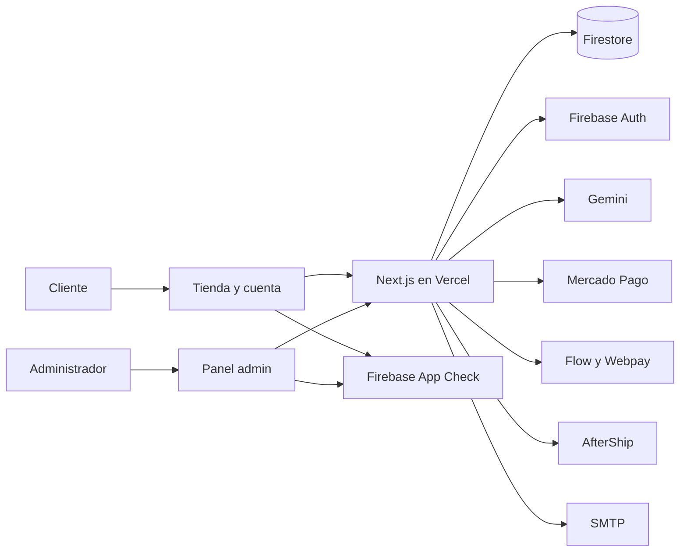
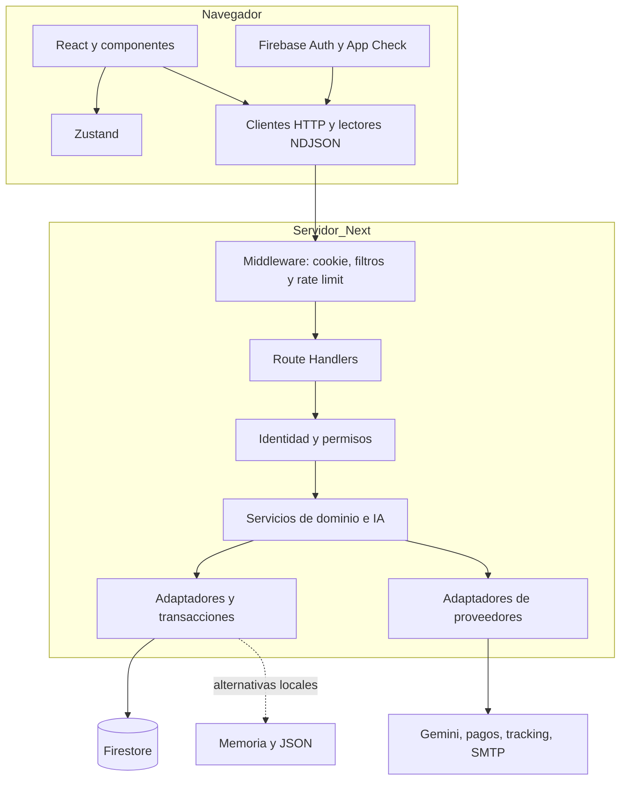
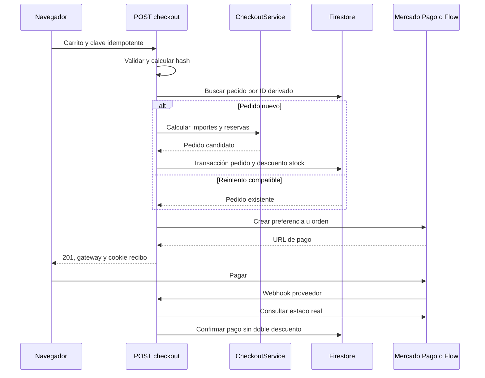
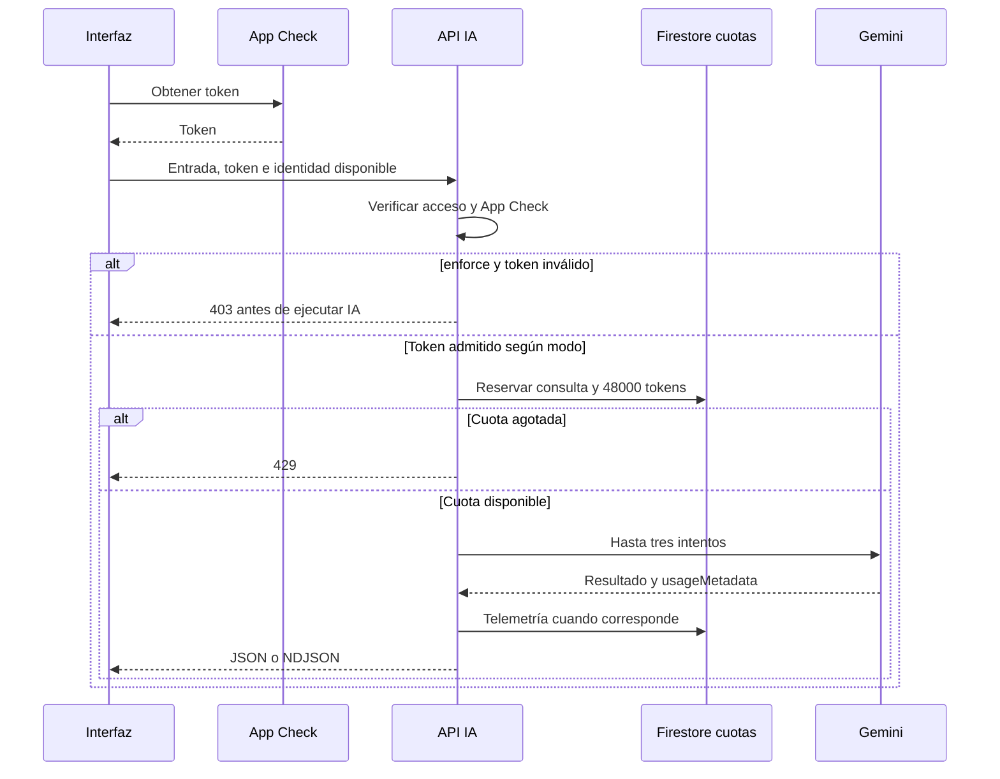
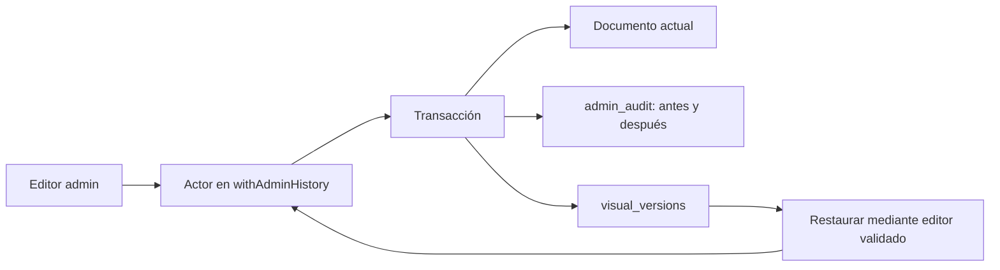

# Arquitectura

## Modelo implementado

Next.js App Router reúne tienda, portal de clientes y administración. Route Handlers del mismo proyecto constituyen el backend; servicios TypeScript encapsulan lógica. Firestore es la persistencia operativa; Firebase Auth proporciona identidad y Firebase Admin opera en servidor. Prisma/PostgreSQL existe como esquema alternativo, sin PrismaClient conectado hallado en src.

No se encontró una cola ni cron productivo en la configuración inspeccionada. Los proveedores se llaman desde las peticiones. Map/singletons/JSON son por proceso o entorno local; no constituyen almacenamiento compartido de Vercel.

## Contexto y proveedores

## Capas

Algunas lecturas utilizan SDK Firebase directamente; no todo acceso pasa por HTTP. Las reglas permiten catálogo/configuración pública y deniegan escrituras SDK cliente. Firebase Admin necesita permisos en las APIs porque las reglas de cliente no lo limitan.

## Checkout

Transferencia no necesita redirección externa. Una pasarela no configurada puede devolver simulación. El callback de retorno Mercado Pago tiene otro camino que confía en URL: ver limitaciones. La llamada a pasarela es posterior a la transacción de inventario y no es atómica con ella.

## Protección IA

Sin persistencia de cuota en producción devuelve 503. Fallos posteriores a reservar consumen cuota. La reserva no representa facturación.

## Auditoría

Solo las mutaciones integradas con writeAdminDocument/contexto quedan bajo este mecanismo; no toda escritura del repositorio.

Fuentes: [middleware](../../src/middleware.ts), [checkout](../../src/app/api/checkout/route.ts), [transacciones](../../src/lib/firebase/commerce.ts), [IA](../../src/lib/services/aiProtection.ts), [historial](../../src/lib/services/adminHistory.ts).
