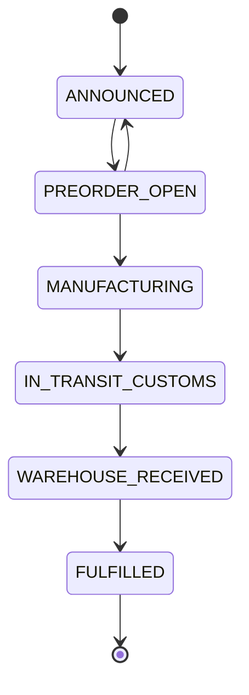

# Backend

Route Handlers Next.js, sin servidor Express independiente. Reciben HTTP y delegan en servicios. Respuestas JSON, redirecciones y NDJSON según operación.

| Servicio | Responsabilidad |
|---|---|
| CheckoutService | Pedido, importes, depósitos, reservas, idempotencia |
| StockReservationService | Reservas TTL y liberación de memoria |
| BundleService | Composición/disponibilidad de paquetes |
| PreOrderService | Estados y depósitos |
| firebase/commerce | Transacciones de pedido/stock/cancelación |
| firebase/firestore | Catálogo, pedidos, perfiles, configuración y caches |
| aiProtection / geminiClient | App Check, cuota, intentos, clave/modelos |
| apiTelemetryService | Eventos de consumo, latencia y agregados |
| adminHistory | Antes/después y versiones |
| alertService / productRequestService | Suscripciones y demanda |
| payments | Mercado Pago, Flow y selección pasarela |
| aftershipService / emailService | Tracking y SMTP |

## Checkout e inventario

POST checkout valida esquema, toma la clave del header/cuerpo, deriva ID y hash. Misma clave con otro contenido produce conflicto. Map deduplica en un proceso; ID persistente/transacción cubren la creación del pedido entre instancias.

Para pedido nuevo sincroniza memoria, prepara candidato y ejecuta commitOrderAndStock. La transacción lee productos/componentes, agrega cantidades, detecta ciclos de bundles, valida existencias, descuenta stock y escribe pedido con stockDeducted=true. Si falla persistencia, rollback del servicio de memoria. Después crea pasarela y guarda checkoutGateway fuera de la transacción: un fallo de proveedor no revierte automáticamente toda la operación.

Cancelar/eliminar devuelve stock una sola vez según stockDeducted, mediante cancelOrderAndRestoreStock. Productos eliminados no se recrean durante devolución. TTL de memoria no es un cron de cancelación de pedidos persistidos.

## Persistencia

Firebase Admin es el camino servidor preferido. Algunas utilidades heredadas intentan SDK cliente/JSON/memoria. Con reglas actuales el cliente no puede escribir. Varias mutaciones de catálogo/configuración responden 503 si en producción no confirman persistencia; los fallbacks no son uniformes y hay que comprobar cada operación.

Los Map/JSON locales no son almacenamiento compartido en serverless. Cache cliente/servidor de catálogo se invalida al mutar. force-dynamic/no-store aparecen en numerosas rutas, sin una política idéntica para toda la API.

## Integraciones

Mercado Pago crea preferencias y webhook consulta pagos; callback tiene otra lógica. WEBPAY usa Flow, no un adaptador Transbank independiente. Transferencia registra orden/instrucciones sin proveedor de cobro. Gemini puede acabar en heurística o presets. AfterShip puede devolver simulación. SMTP requiere configuración; el handler de contacto no envía correo.

No hay formato de error global: algunas rutas usan success/data/error, otras error/code/message. Comprobar HTTP y validar body; un stream iniciado puede llevar HTTP 200 y evento error posterior.

Fuentes: [checkout](../../src/app/api/checkout/route.ts), [servicio](../../src/lib/services/CheckoutService.ts), [transacciones](../../src/lib/firebase/commerce.ts), [dominio](../../src/lib/types/domain.ts).

## Estados de preventa

Transiciones de PreOrderService; cierre final no admite siguiente estado. La ruta transition usa el servicio de memoria y no incluye autorización explícita: este diagrama no demuestra persistencia de esas transiciones. Un depósito usa la configuración del producto; no asumir 20% obligatorio para todos los casos.
