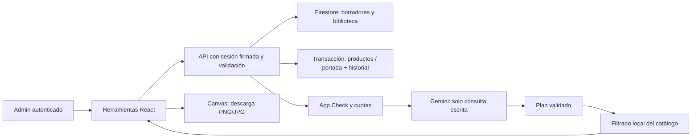

# Contenido y herramientas de administración

Implementado el 4 de octubre de 2026. Acceso: **Admin → Herramientas**, en `/admin/tools`. El laboratorio también aparece en **Personalización Visual → Laboratorio de la tienda**. Todas las operaciones de gestión requieren sesión administrativa verificada por el servidor.

## Importar productos desde Excel o CSV

En la pestaña Importador descarga una plantilla CSV o XLSX. Se admiten archivos `.csv` y `.xlsx`, hasta 2 MiB, una hoja y 100 productos. No se admiten XLS, XLSM, macros, fórmulas ni celdas complejas. Las columnas obligatorias, en este orden, son:

`sku,nombre,tipo,precio,costo,stock,descripcion,imagen`

Tipos: FIGURE, VIDEO_GAME, COLLECTIBLE, CONSOLE, HARDWARE y OTHER. Precio y costo usan pesos CLP enteros, incluyendo valores como 54990. Stock también es entero. Imagen acepta una URL HTTPS o ruta local; puede quedar vacía.

1. Elige crear productos nuevos o actualizar por SKU.
2. Carga el archivo y revisa la tabla: los errores aparecen por fila.
3. Selecciona hasta 25 filas válidas. Revisa el lote y confirma para guardarlo.

La vista previa no modifica productos. Expira después de una hora. Cada vista previa confirma un único lote; para importar más filas vuelve a cargar el archivo. SKU duplicados o ambiguos, packs y preventas deben resolverse en el editor especializado. El stock no puede quedar por debajo del reservado. Actualizar conserva precio normal y especificaciones existentes; una imagen vacía conserva las anteriores. Una imagen indicada reemplaza la lista de imágenes de ese producto.

El servidor vuelve a verificar el catálogo durante la transacción. Si alguien cambió un producto o creó el mismo SKU, rechaza todo el lote con 409. Productos, historial y marca de lote confirmado se guardan juntos. Repetir una confirmación ya realizada no duplica productos.

### Cargar Google Sheets desde Drive

En el importador selecciona **Google Sheets (Drive)**. Se admite un archivo nativo de Google Sheets, mediante su enlace `https://docs.google.com/spreadsheets/d/ID/edit`; no es un explorador de todo Drive. Si tu archivo de Drive es XLSX, conviértelo a Google Sheets o usa la carga local de Excel.

Configuración inicial:

1. En Google Cloud, elige el proyecto de la cuenta de servicio que usas para Firebase y [habilita Google Sheets API](https://console.cloud.google.com/apis/library/sheets.googleapis.com).
2. En Google Sheets pulsa **Compartir** y añade como **Lector** el correo mostrado dentro del importador. Es el valor de `FIREBASE_CLIENT_EMAIL`; la clave privada nunca se muestra. La hoja puede seguir privada.
3. No añadas claves públicas ni variables OAuth nuevas en Vercel: se reutilizan `FIREBASE_CLIENT_EMAIL` y `FIREBASE_PRIVATE_KEY` del servidor. Despliega el código que contiene esta función.

Carga y revisión:

1. Pega el enlace y pulsa **Conectar hoja**. Se obtiene el nombre del documento y su lista de pestañas; un `gid` válido del enlace preselecciona la pestaña correspondiente.
2. Elige la pestaña. Coloca los mismos ocho encabezados en **A1:H1** y los productos desde la fila 2.
3. Pulsa **Previsualizar Google Sheets**. El servidor lee una copia de los datos actuales y aplica el mismo modo de crear/actualizar, validaciones por fila y límite de 25 productos por lote. Confirma el lote para guardar.
4. Cambiar enlace, pestaña, origen o modo invalida la vista previa. La hoja original no se modifica. Si editas Google Sheets después de previsualizar, vuelve a cargar para incorporar esas ediciones: no hay sincronización automática.

Se usa el alcance OAuth [spreadsheets.readonly](https://developers.google.com/workspace/sheets/api/scopes). La cuenta solo puede acceder a hojas que le compartas; no se solicita acceso al Drive de tu usuario. Los [valores se leen sin formato](https://developers.google.com/workspace/sheets/api/reference/rest/v4/spreadsheets.values/get), de forma que un precio mostrado como moneda llegue como número. En Sheets se importa el resultado calculado de las fórmulas; no se ejecutan sus expresiones en esta aplicación. Guarda SKU y tipo como texto. Se conserva el límite de 100 productos, 2000 caracteres por celda y 2 MiB por respuesta. Se leen las filas de A:H, más la columna I como comprobación de columnas extra; otras columnas no se importan. La respuesta completa está limitada a 2 MiB y las pestañas con más de 100 productos se rechazan, sin recortarlas silenciosamente. Divide una pestaña grande antes de cargarla. Se limita también la respuesta de metadatos a 200 pestañas compatibles.

La ruta solo acepta enlaces del host `docs.google.com` y construye peticiones a `sheets.googleapis.com`, sin seguir redirecciones. Las credenciales y tokens permanecen en el servidor, los datos no se envían a IA y las respuestas administrativas no se almacenan en caché. Los errores 403 indican permisos o API deshabilitada, 404 hoja inexistente/no compartida, 409 pestaña eliminada, 429 cuota temporal y 503 autenticación o proveedor indisponible. Ninguno guarda productos.

Las pruebas de esta integración usan respuestas de Google simuladas; una lectura real requiere habilitar la API y compartir una hoja. No se ha habilitado la API ni cambiado permisos de Drive automáticamente.

## Biblioteca de imágenes

En Imágenes puedes subir PNG, JPG o WebP de hasta 5 MiB. El navegador reduce la resolución a un máximo de 1200 píxeles por lado y comprime a WebP hasta 350 KiB. Se rechazan imágenes de más de 20 megapíxeles. El servidor comprueba tamaño, tipo y firma del formato. SVG no se admite.

Puedes buscar por nombre o etiquetas, renombrar, cambiar etiquetas, mover al inicio, copiar la URL y archivar o recuperar. La biblioteca admite hasta 100 imágenes almacenadas. Archivar oculta la imagen de la lista activa; conserva el archivo y su URL para evitar romper productos. No libera capacidad: no existe borrado físico en esta primera versión.

Los editores de producto nuevo y existente incluyen **Biblioteca de imágenes**. Elegir una foto añade su URL al formulario; el producto se modifica al guardar el formulario. Las fotos son públicas mediante `/api/media/[id]`, necesarias para mostrarlas en la tienda. Los metadatos de gestión son privados. La imagen se almacena en Firestore, sin configurar un proveedor adicional de almacenamiento. Esta solución tiene límites deliberados para una biblioteca pequeña; una biblioteca grande requeriría migración a almacenamiento de archivos.

## Laboratorio de la tienda

El laboratorio trabaja sobre la **portada principal**, con sus textos, enlaces, producto destacado y dos colores. Usa el mismo componente de la tienda. Ofrece una vista compacta de 390 píxeles y una vista amplia, además de comparación con la portada publicada. No simula todos los tamaños de navegador ni edita el tema completo.

Guardar crea un borrador privado y deja intacta la portada pública. Publicar exige confirmación y comprueba que la portada no cambió desde la creación del borrador. Si hubo otro guardado, actualiza y crea un nuevo borrador. Si elegiste un producto destacado, debe seguir disponible.

La publicación escribe la portada, el historial y una versión guardada en una sola transacción. Conserva la portada anterior como versión inicial cuando corresponde e invalida la portada pública. Se muestran los últimos 20 borradores; no se eliminan automáticamente los anteriores.

## Asistente de administración

El asistente interpreta consultas como «productos sin imagen», «productos sin descripción», «productos sin stock» o búsquedas por nombre/SKU/tipo. Consulta hasta 1000 productos y devuelve hasta 100 resultados.

**Solo el texto que escribes se envía a Gemini.** El catálogo se filtra dentro del servidor; nombres, precios, stock y clientes del catálogo no se adjuntan a la petición al modelo. La respuesta del modelo se valida contra un esquema cerrado. No ejecuta comandos arbitrarios ni modifica precios, stock o pedidos.

Puedes pedir borradores de descripción para hasta cinco resultados. Se componen localmente con el nombre del producto y una introducción genérica propuesta por el modelo; requieren revisión humana y no acreditan datos técnicos. Se muestra antes/después. Selecciona, revisa y confirma para aplicar. Las propuestas expiran en una hora y la transacción rechaza productos modificados mientras revisabas. Solo cambia la descripción y la fecha de actualización, con historial.

Usa la configuración Gemini existente, App Check y las cuotas persistentes de IA. Una respuesta inválida o un proveedor indisponible muestra error; no se sustituye por una respuesta ficticia. No necesita otra variable de entorno.

## Fichas para redes

Elige un producto para generar una ficha cuadrada (1080 × 1080), vertical (1080 × 1350) o historia (1080 × 1920). Puedes editar la marca, el color de fondo, mostrar u ocultar el precio y elegir otra foto de la biblioteca. Usa el nombre, precio y condición de preventa reales del catálogo.

Descarga PNG o JPG. Se genera en el navegador; no publica en redes sociales ni envía mensajes. Si una imagen externa no autoriza su uso en canvas mediante CORS, el generador lo indica: selecciona una foto de la biblioteca para exportar. La vista solo habilita descargas al completar la generación.

## APIs y datos

| API | Métodos | Uso |
|---|---|---|
| `/api/admin/tools/catalog` | GET | Catálogo privado para laboratorio y fichas |
| `/api/admin/import/google-sheets` | GET, POST | Configuración de lectura, pestañas y valores de Google Sheets |
| `/api/admin/import` | POST | Vista previa o confirmación del lote |
| `/api/admin/media` | GET, POST, PATCH | Listado, subida y metadatos de imágenes |
| `/api/media/[id]` | GET | Archivo raster público por UUID |
| `/api/admin/laboratory` | GET, POST | Portada, borradores, guardado y publicación |
| `/api/admin/assistant` | POST, PATCH | Consulta protegida y aplicación de propuestas |

Colecciones nuevas privadas: `import_jobs`, `media_assets`, `media_blobs`, `media_control`, `visual_drafts`, `assistant_plans`. El acceso directo desde clientes Firestore está denegado por las reglas existentes; solo el servidor accede. La ruta pública de imagen entrega únicamente el binario permitido. Los trabajos y propuestas caducan lógicamente, sin borrado TTL automático; debe considerarse retención si aumenta el uso. Las mutaciones reutilizan `admin_audit` y las publicaciones `visual_versions`.

## Verificación y despliegue

Las pruebas cubren plantillas XLSX reales, CSV, límites, MIME, acceso no autorizado, confirmaciones de interfaz, conflictos y privacidad del asistente. El emulador comprueba permisos y transacciones reales, sin escribir en producción. Despliega el código nuevo en Vercel para ver el menú. No requiere nuevas variables; necesita las credenciales Firebase y Gemini ya configuradas. No se habilitan cobros ni ventas reales.
