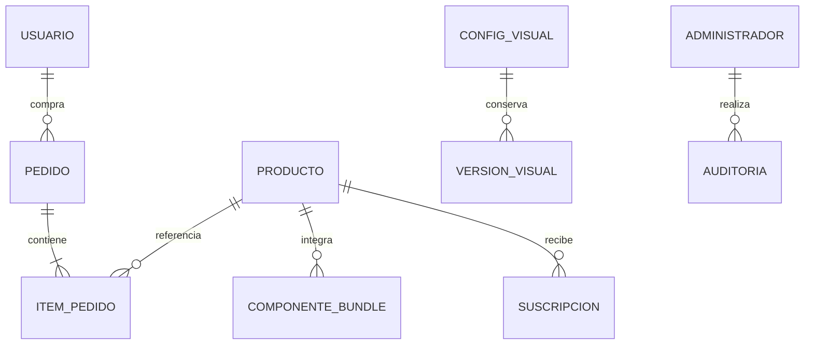

# Datos y persistencia

## Entidades

| Entidad | Campos principales | Invariante |
|---|---|---|
| Producto | id, sku, name, type, price, costPrice, stockAvailable, metadata, images | CLP entero y stock no negativo |
| Bundle | Producto BUNDLE y bundleComponents | Depende de componentes y cantidades |
| Pedido | id, orderNumber, items, customer, shippingMethod, checkoutRequestHash, stockDeducted | Pedido/stock inicial comparten transacción |
| Perfil | UID/email, datos, direcciones, favoritos | Identidad verificada controla acceso |
| Reserva | producto, cantidad, estado, expiresAt | TTL del servicio; no TTL automático Firestore |
| Suscripción | producto/SKU, email, estado | Consulta/baja propietario/admin |
| Solicitud | título, franquicia, email/notas, estado | Demanda de productos |
| Cuota IA | día, requests, tokens, blocked, unchecked | Global y actor hash en transacción |
| Auditoría | actor, fecha, colección/id, acción, before/after | Escrituras integradas con contexto |
| Versión | section, name, actor, at, payload | Restauración validada por sección |

Tipos: [domain.ts](../../src/lib/types/domain.ts); inputs: [schemas.ts](../../src/lib/validations/schemas.ts). Firestore usa documentos con metadata embebida; el modelo Prisma es una alternativa relacional sin adaptador operativo hallado.

## Relaciones conceptuales

Firestore no impone claves foráneas. Hay pedidos de invitados y snapshots de artículos; las relaciones son lógicas. Limpieza de referencias integrada evita enlaces obsoletos en catálogo y configuraciones.

## Configuración y documentos especiales

| Sección | Ruta |
|---|---|
| Portada | branding_settings/home_hero |
| Marca | branding_settings/main_brand |
| Carrusel | slider_settings/home_slider |
| Anuncios | announcement_settings/main_bar |
| Laterales | side_banners_settings/main_skins |
| Eventos API | kpi_snapshots/api_telemetry_store/events/{id} |
| Diagnóstico stock | kpi_snapshots/predictive_stock_latest |
| Cuota global | ai_quotas/{YYYY-MM-DD}-global |
| Sesión activa | active_sessions/{email} |
| Historial/versiones | admin_audit/{id}, visual_versions/{id} |

También hay documentos de cuotas por hash de actor. Restaurar versiones depura referencias contra catálogo actual. Telemetría admite lectura de registros heredados además de subcolección de eventos.

## Reglas

Catálogo y diseño publicado son de lectura SDK pública; usuario/pedido tienen condiciones propietarias. Se deniegan todas las escrituras SDK cliente y lectura no prevista. Firebase Admin no está sujeto a reglas cliente: APIs deben autorizar. expiresAt no configura por sí mismo TTL de Firestore.

## Colecciones declaradas

Una constante de colección no demuestra que todos sus datos se escriban en producción.
| Constante | Colección |
|---|---|
| `PRODUCTS` | `products` |
| `ORDERS` | `orders` |
| `USERS` | `users` |
| `RESERVATIONS` | `reservations` |
| `CSV_BACKUPS` | `csv_backups` |
| `KPI_SNAPSHOTS` | `kpi_snapshots` |
| `ANALYTICS` | `analytics` |
| `SLIDER_SETTINGS` | `slider_settings` |
| `BRANDING_SETTINGS` | `branding_settings` |
| `ANNOUNCEMENT_SETTINGS` | `announcement_settings` |
| `SIDE_BANNERS_SETTINGS` | `side_banners_settings` |
| `PRODUCT_ALERTS` | `product_alerts` |
| `PRODUCT_REQUESTS` | `product_requests` |
| `CUSTOM_CATEGORIES` | `custom_categories` |

## Lectura de notificaciones

notification_reads almacena ids (hasta 500 hashes) y updatedAt por identidad. Acceso exclusivo del servidor: no habilitar lectura/escritura directa del cliente. [Detalles](salud-busqueda-notificaciones.md).
